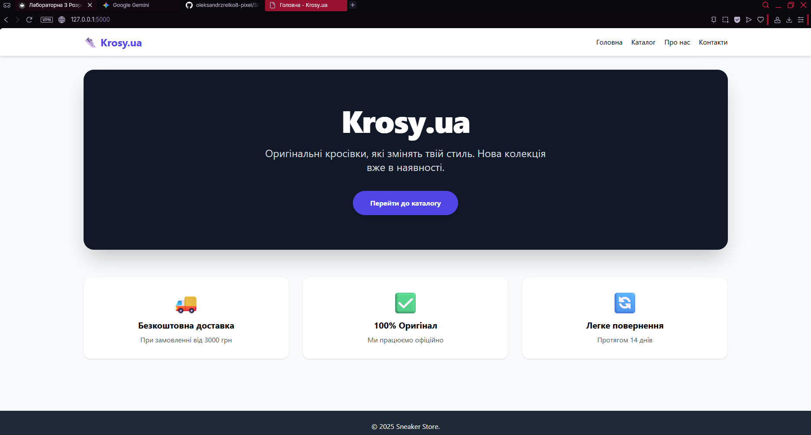
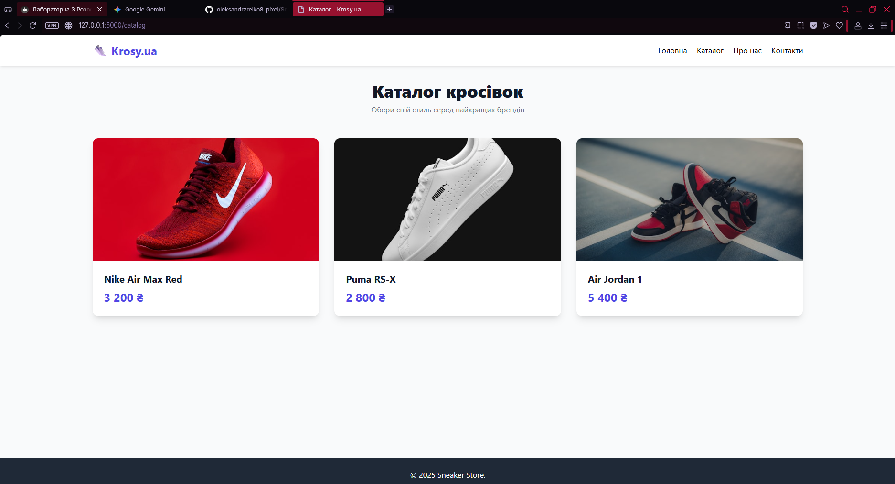
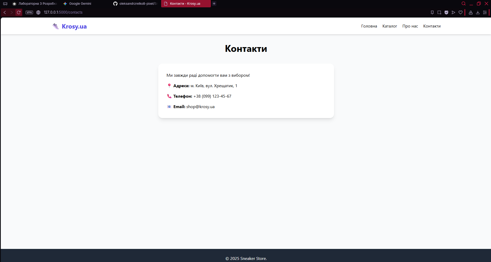

# Звіт з лабораторної роботи 3

## Розробка базового вебпроєкту

### Інформація про команду
- **Назва команди:** Sneaker Devs
- **Учасники:**
  - Зрелко Олекасндр (Team Lead / Git Master / Backend)
  - Дендера Олександр (Frontend Developer / Designer)

## Завдання

### Обрана предметна область
Вебзастосунок **"Krosy.ua"** — спеціалізований інтернет-магазин спортивного взуття (кросівок). 
Сайт призначений для перегляду асортименту товарів від відомих брендів (Nike, Puma, Adidas), ознайомлення з інформацією про магазин та команду, а також для надання контактних даних для зворотного зв'язку.

### Реалізовані вимоги

Вкажіть, які рівні завдань було виконано:

- [x] Рівень 1: Створено сторінки "Головна" та "Про нас"
- [x] Рівень 2: Додано мінімум дві додаткові статичні сторінки з меню та адаптивною версткою (Каталог, Контакти)

## Хід виконання роботи

### Підготовка середовища розробки

Процес налаштування включав наступні кроки:
1.  Встановлено **Python 3.11**.
2.  Створено віртуальне оточення: `python -m venv .venv`.
3.  Активовано оточення та оновлено pip.
4.  Встановлено мікрофреймворк **Flask**: `pip install flask`.
5.  Створено файл залежностей: `pip freeze > requirements.txt`.
6.  Налаштовано **Git**: ініціалізація репозиторію, створення `.gitignore`, підключення до GitHub.

Інструменти: Visual Studio Code, Git Bash / CMD, Tailwind CSS (CDN).

### Структура проєкту

```text
sneaker_store/
├── .venv/                  # Віртуальне оточення
├── app.py                  # Головний файл запуску (Backend)
├── requirements.txt        # Список бібліотек
├── templates/              # HTML-шаблони
│   ├── base.html           # Базовий шаблон (меню + футер)
│   ├── index.html          # Головна сторінка
│   ├── about.html          # Сторінка "Про нас"
│   ├── catalog.html        # Каталог товарів
│   └── contacts.html       # Контакти
├── static/                 # Статичні файли
│   ├── css/                
│   └── images/             # Зображення кросівок
└── lab-reports/            # Звіти
    ├── lab03-report.md     # Цей файл
    └── image-1.png         # Скріншоти


    Опис реалізованих сторінок
Головна сторінка (index.html) 
Містить Hero-секцію (вітальний банер) з кнопкою переходу до каталогу та блок "Переваги" (швидка доставка, оригінальність). Використовує Jinja2 для наслідування структури від base.html.

Сторінка "Про нас" (about.html) 
Інформаційна сторінка, що містить опис місії магазину та перелік учасників команди розробників із зазначенням їхніх ролей.

Додаткові сторінки 
Каталог (catalog.html): Реалізовано адаптивну сітку товарів (Grid layout). На комп'ютері відображається по 3 товари в ряд, на мобільних пристроях — по 1. Кожна картка товару містить фото, назву та ціну. 

Контакти (contacts.html): Сторінка з контактною інформацією та стилізованою формою зворотного зв'язку (ім'я, email, повідомлення). 

Ключові фрагменти коду
Маршрутизація в Flask
Файл app.py:

Python

from flask import Flask, render_template

app = Flask(__name__)

@app.route('/')
def home():
    return render_template('index.html', title="Головна")

@app.route('/catalog')
def catalog():
    return render_template('catalog.html', title="Каталог")

# ... інші маршрути ...

if __name__ == '__main__':
    app.run(debug=True)
Базовий шаблон
Файл base.html (реалізація DRY та адаптивного меню):

HTML

<!DOCTYPE html>
<html lang="uk">
<head>
    <meta charset="UTF-8">
    <title>{{ title }} - Krosy.ua</title>
    <script src="[https://cdn.tailwindcss.com](https://cdn.tailwindcss.com)"></script>
</head>
<body class="bg-gray-50 flex flex-col min-h-screen">
    <nav class="bg-white shadow-md">
         </nav>

    <main class="container mx-auto px-6 py-8 flex-grow">
        
    </main>

    <footer class="bg-gray-800 text-white py-6 mt-auto text-center">
        </footer>
</body>
</html>
Розподіл обов'язків у команді
[Зрелко] (Team Lead / Backend):

Ініціалізація Git-репозиторію та налаштування .gitignore.

Розробка архітектури додатку (app.py, структура папок).

Налаштування маршрутизації (Routes).

Створення базового шаблону base.html.

Злиття змін (Merge) та вирішення конфліктів.

[Дендера] (Frontend):

Розробка дизайну сторінок.

Верстка index.html, catalog.html, contacts.html.

Підключення та налаштування Tailwind CSS.

Пошук та додавання контенту (зображення, тексти).

Головна сторінка
Каталог (Адаптивна сітка)
Адаптивність (Мобільна версія)
Висновки
В ході виконання лабораторної роботи ми успішно розробили базовий веб-застосунок на Flask.

Вдалося реалізувати: повноцінну структуру MVC (Model-View-Controller), адаптивний дизайн за допомогою Tailwind CSS, динамічну зміну заголовків сторінок.

Труднощі: виникли проблеми з політикою виконання скриптів у PowerShell (вирішено переходом на CMD) та помилки дублювання блоків у Jinja2 (виправлено рефакторингом коду).

Отримані навички: робота з віртуальним оточенням, командна робота в Git, основи шаблонізатора Jinja2.

Вдосконалення: у майбутньому планується додати базу даних SQLite для зберігання товарів та адмін-панель.

Очікувана оцінка: 11 балів.

Обґрунтування: Виконано всі вимоги достатнього та високого рівнів. Проєкт має чисту структуру, код прокоментований, реалізовано 4 сторінки замість 2 мінімальних, забезпечено повну адаптивність дизайну.